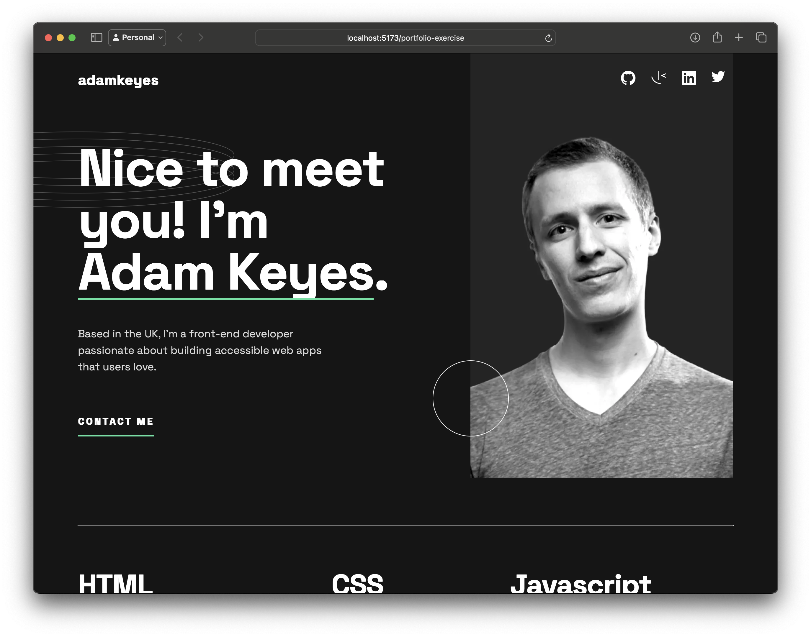

# Frontend Mentor Portfolio Project



A sample portfolio project.

# 👨‍💻 Frontend Mentor page

https://www.frontendmentor.io/solutions/singlepage-portfolio-page-ckpqOAYFBF

# ⚡️ Live site 

https://ghoulkingr.github.io/portfolio-exercise/


# 🏃‍♂️‍➡️ Running this project locally

If you want to run this project locally follow these steps:
1. Install the dependencies:
```bash
npm i
```
2. Run the development server:
```bash
npm run dev
```

After following these steps, you will see the url of the web app in your terminal. Open that url in your browser to see the web app.